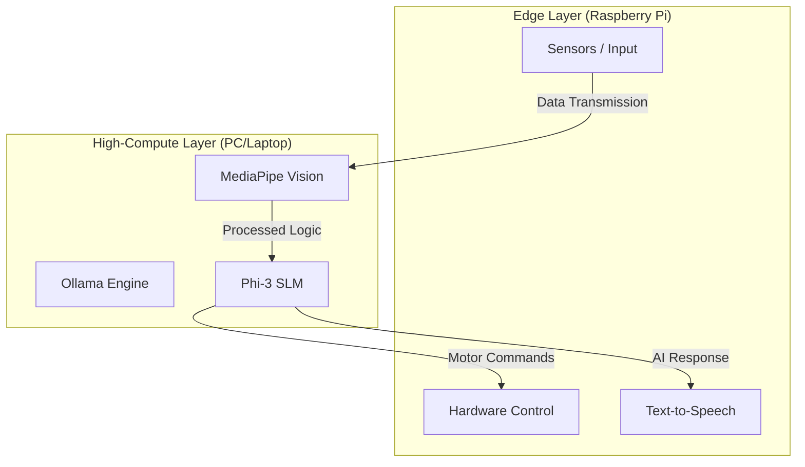

# 🤖 openSource Robot Middleware!

Welcome! This is project to give a robot a **distributed AI brain** using **Ollama** (AI engine), **Phi-3** (Small Language Model), and **MediaPipe** for gesture control.

The project demonstrates a **Dual Architecture Robotics System** designed to run AI models efficiently using a **high-compute computer (PC/Laptop)** and a **low-compute single-board computer (Raspberry Pi)**.

---

# 🧠 Dual Architecture Concept (Main Idea)

This project is based on a **Dual Architecture Robotics System**.

Instead of running everything on a small computer like a Raspberry Pi, the system splits the workload:

### 💻 High-Compute Layer (Laptop / PC)
Runs heavy AI tasks:
- Small Language Models (Phi-3 via Ollama)
- Computer Vision (MediaPipe)
- AI reasoning and processing
- Performance benchmarking

### 🍓 Edge Layer (Raspberry Pi / SBC)
Handles lightweight robot operations:
- Sensors and user input
- Text-to-Speech
- Motor control
- Hardware communication

### Why this architecture?

Small computers like Raspberry Pi cannot efficiently run modern AI models.  
By **offloading heavy computation to a PC**, we can:

- Run **SLM / LLM models**
- Use **computer vision**
- Maintain **low-cost hardware**
- Improve **response speed**
- Keep the robot lightweight and energy efficient

This approach is common in **edge robotics, distributed AI systems, and cloud-robotics research**.

---

## 🛠️ System Overview (Mermaid Diagram)



---

## 🌟 What does this do?

1. **The Brain (`raju_brain`)**
   
   Uses the **Phi-3 AI model** running on **Ollama** to answer questions.

   If the robot receives text input, the AI generates a response and sends it back.

2. **The Hand Controller (`hand_servo_publisher`)**
   
   Uses **MediaPipe** and your webcam to detect hand gestures.

   It counts the number of open fingers and converts that into a **servo motor angle** to control a robot arm.

---

## 🚀 How to set it up (Easy Mode)

If you are on a new Linux computer, follow these simple steps:

### 1. Open your Terminal
Press `Ctrl + Alt + T` on your keyboard to open the command line.

### 2. Go to the project folder
Type this and press Enter:

```bash
cd ~/Downloads/ros2/opensourcerobo
```

### 3. Run the installer

This magic script will install everything you need (Python libraries, Ollama, and the Phi-3 model).

```bash
bash setup_dependencies.sh
```

*Note: This might take a few minutes because the AI model is about 2GB.*

---

## 📡 Connecting to a Raspberry Pi

If your robot has a Raspberry Pi inside and you want your PC to talk to it:

### 1. Make sure both are on the same Wi-Fi

Your laptop/PC and the Raspberry Pi must be on the same internet network.

### 2. Set the "Secret Number" (Domain ID)

Both computers need to use the same "Domain ID" (like a secret channel).

On your PC, run this command:

```bash
source setup_network.sh 42
```

*(You can use any number, but make sure the Raspberry Pi uses the same one!)*

---

## 🎮 How to run it

Once the installer is finished, you can start the robot with one command:

```bash
bash run_raju.sh
```

### What happens now?

* **Ollama** starts in the background
* The **AI Brain** loads the Phi-3 model
* Your **Webcam** opens
* **MediaPipe** detects your hand gestures
* ROS 2 sends commands to the robot

Try showing **2 fingers or 5 fingers** to control the robot arm!

---

## ✨ For Curious Minds (How it works)

### Ollama

Think of this as the **engine** that runs AI models locally.

### Phi-3

A **Small Language Model (SLM)** developed by Microsoft.
It provides conversational intelligence without requiring cloud APIs.

### ROS 2

The **robot communication framework** that allows different nodes (AI, sensors, motors) to talk to each other.

### MediaPipe

A **real-time vision framework by Google** used for detecting hands, gestures, and body movements.

---

## 🧪 Research Goal

This project explores:

* **Distributed AI for robotics**
* **SLM deployment on low-cost robots**
* **Edge computing architectures**
* **Performance comparison between PC and SBC devices**

The system demonstrates that **dual architecture robotics can significantly improve AI performance on low-power robotic platforms**.

---

### 🛠️ Troubleshooting

**Webcam not opening?**

Make sure no other apps (Zoom, Teams, etc.) are using the camera.

**AI not responding?**

Ensure the first setup had internet access so the Phi-3 model could download.

---

Have fun building! 🚀
